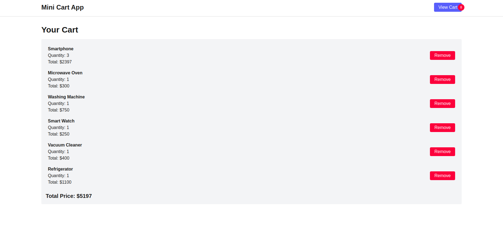

# Mini Cart App

This is a mini cart app made with NextJS following MVC architecture. This app demonstrates the state management via Redux Tool Kit (RTK) and a simple api in Nextjs using MongoDB as databse.



## Table of Contents

- [Getting Started](#getting-started)
- [Installation](#installation)
- [Features](#features)
- [Tech Stack](#tech-stack)
- [Usage](#usage)

## Getting Started

To get started with this shopping cart app, follow the instructions below.

### Prerequisites

Make sure you have the following installed:

- **Node.js** (v14 or higher)
- **MongoDB** (Running locally or on a cloud service like MongoDB Atlas)

### Installation

1. Clone the repository:

```bash
git clone https://github.com/NashTech-Labs/mini-kart-app-Next-MVC-
cd mini-kart-app-Next-MVC-
```

2. Install the dependencies:

```bash
npm install
```

3. Create a `.env.local` file in the root directory:

```bash
touch .env.local
```

4. Add your MongoDB URI to the `.env.local` file:

```bash
MONGODB_URI=your-mongodb-uri
NEXT_PUBLIC_API_URL=your-nextjs-url
```

5. Start the development server:

```bash
npm run dev
```

Now, your app should be running at http://localhost:3000.

#### Features

- **Product List:** Displays a list of available products fetched from MongoDB.
- **Add to Cart:** Allows users to add products to the cart.
- **Cart Management:** Displays the cart contents, total quantity, and total price.

#### Tech Stack

- **Next.js (v14)** with the App Router
- **TypeScript** for static typing
- **MongoDB** for database
- **Redux Toolkit (RTK)** for state management
- **Tailwind CSS** for styling
- **Mongoose** for interacting with MongoDB

#### Usage

1. **Add Products to DB**

Before you can use the app, you'll need to add some products to your MongoDB database.

Here’s an example of inserting products via MongoDB shell or a database GUI:

```bash
use your-database

db.products.insertMany([
  { name: "Smartphone", price: 599, description: "Latest model smartphone" },
  { name: "Laptop", price: 1299, description: "High-performance laptop" },
  { name: "Smart TV", price: 799, description: "4K Ultra HD Smart TV" },
  { name: "Headphones", price: 199, description: "Noise-cancelling headphones" },
  { name: "Smartwatch", price: 249, description: "Fitness tracking smartwatch" },
  { name: "Camera", price: 899, description: "Professional digital camera" },
  { name: "Tablet", price: 399, description: "Portable tablet with stylus" },
  { name: "Wireless Speaker", price: 149, description: "Bluetooth wireless speaker" },
  { name: "Gaming Console", price: 499, description: "Next-gen gaming console" },
  { name: "Router", price: 99, description: "Wi-Fi 6 high-speed router" }
])
```

### Key Sections in the `README.md`:

- **Installation Instructions**: Setting up the environment and starting the app.
- **Project Structure**: A breakdown of the folder structure.
- **Features**: Describes what the app does.
- **Usage**: Explains how to insert products and interact with the app.
- **Tech Stack**: Lists the technologies used in the project.

This guide helps any user or developer set up and run the project without diving into the code base itself.
